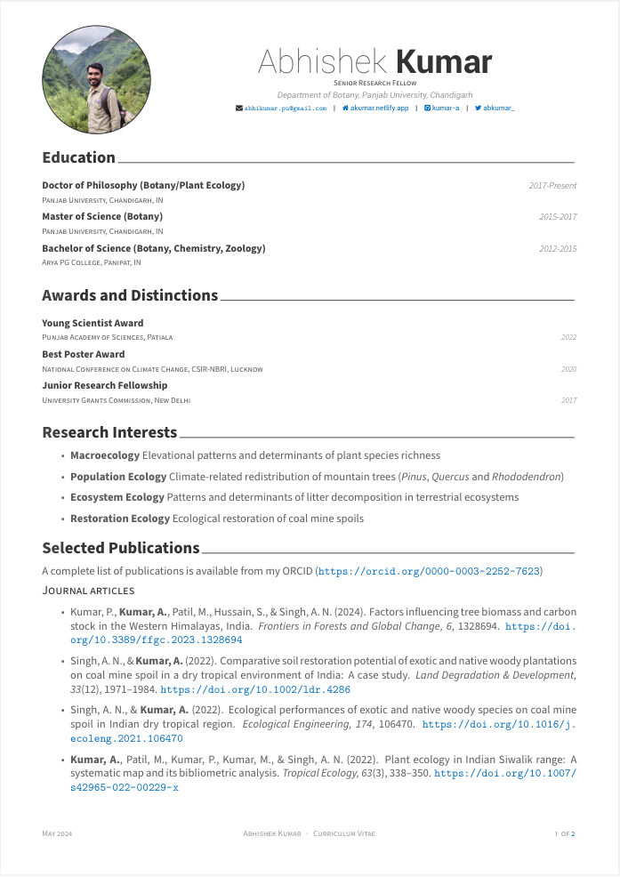

# my-cv

This repository contains my curriculum vitae and the code use to build it using the `R` package [`vitae`](https://github.com/mitchelloharawild/vitae) developed by [Mitchell O'Hara-Wild](https://github.com/mitchelloharawild). Thanks to Mitchell for making it possible to build an elegant CV.

## Preview

